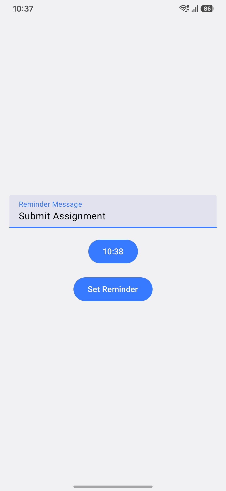

# Reminder Alarm Manager

A simple Android Reminder Application built using **Kotlin** and **Jetpack Compose** that allows users to schedule reminders at a specific time. The application uses **AlarmManager**, **BroadcastReceiver**, and **Notification APIs** to trigger reminders even when the device is idle.

---
## Features

* Set custom reminder messages
* Select reminder time using a Time Picker
* Schedule exact alarms
* Support for Android 12+ Exact Alarm Permission
* Support for Android 13+ Notification Permission
* Displays high-priority notifications
* Opens Reminder screen automatically when reminder triggers
* Works during Doze Mode using `setExactAndAllowWhileIdle()`
* Built completely with Jetpack Compose UI

---

## Technologies Used

* Kotlin
* Jetpack Compose
* AlarmManager
* BroadcastReceiver
* NotificationCompat
* PendingIntent
* Material 3
* Android Runtime Permissions

---

```
app/
│
├── MainActivity.kt
├── AlarmReceiver.kt
├── ReminderActivity.kt
├── ui/theme/
└── AndroidManifest.xml
```

---

## How It Works

### Step 1: Enter Reminder Message

The user enters a custom reminder message.

### Step 2: Select Time

A TimePickerDialog allows the user to choose a reminder time.

### Step 3: Schedule Alarm

The app schedules an exact alarm using:

```kotlin
alarmManager.setExactAndAllowWhileIdle()
```

This ensures alarms are delivered even during Doze Mode.

### Step 4: BroadcastReceiver Triggered

At the scheduled time, `AlarmReceiver` receives the broadcast.

### Step 5: Notification Displayed

A high-priority notification is generated.

Features of notification:

* High Priority
* Alarm Category
* Auto Cancel
* Opens ReminderActivity
* Full Screen Intent support

---
# 📱 Screenshots

<p align="center">
  
  &nbsp;&nbsp;&nbsp;
  
</p>
## Project Structure
## Permissions Required

### Android 13+

Notification permission:

```xml
<uses-permission android:name="android.permission.POST_NOTIFICATIONS"/>
```

---

### Android 12+

Exact Alarm permission:

```xml
<uses-permission android:name="android.permission.SCHEDULE_EXACT_ALARM"/>
```

---

## Main Components

### MainActivity

Responsible for:

* Requesting notification permission
* Showing Reminder Scheduler UI
* Scheduling alarms

### AlarmReceiver

Responsible for:

* Receiving alarm broadcasts
* Creating notification channel
* Showing notifications
* Launching ReminderActivity

### ReminderActivity

Responsible for:

* Displaying reminder message
* Showing reminder details in Compose UI

---

## Future Improvements

* Repeat reminders
* Date Picker support
* Custom alarm sounds
* Reminder history
* Edit/Delete reminders
* Room Database integration
* Snooze functionality
* Dark mode optimization

---

## Installation

Clone the repository:

```bash
git clone https://github.com/yourusername/ReminderAlarmManager.git
```

Open the project in Android Studio.

Build and Run on a device or emulator.

---

## Screenshots

Add screenshots here:

```
screenshots/
├── HomeScreen.png
├── TimePicker.png
├── Notification.png
├── ReminderScreen.png
```

---

## Learning Outcomes

This project demonstrates practical knowledge of:

* AlarmManager
* BroadcastReceiver
* Notifications
* PendingIntent
* Exact Alarm Scheduling
* Android Permissions
* Jetpack Compose
* Material Design 3
* Android Lifecycle Components

---

## Author

**Vishal Dhiman**

B.Tech Student | Android Developer

Learning Android Development, Kotlin, Jetpack Compose, and Mobile Application Architecture.
